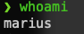
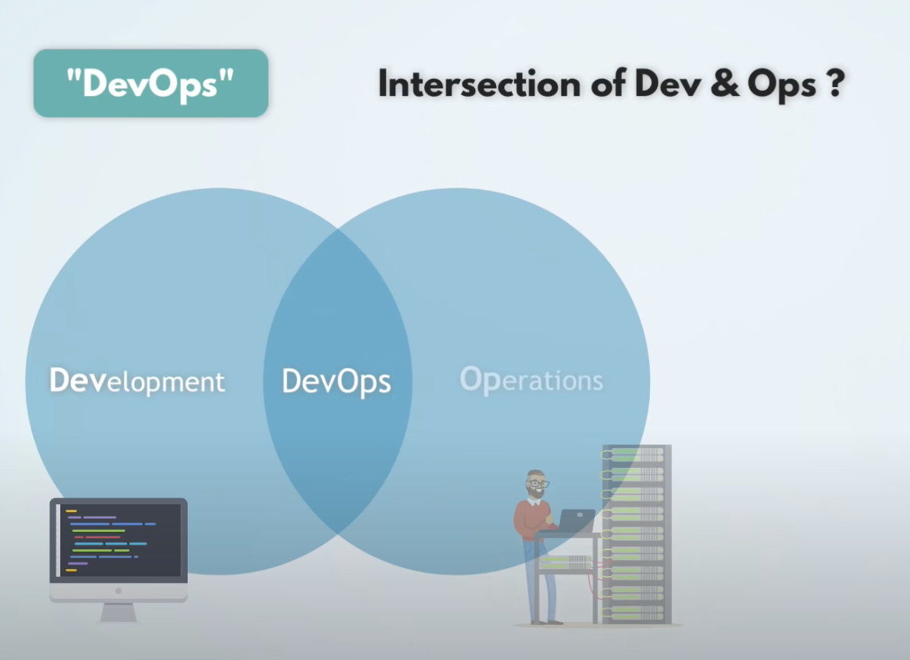

# DevOps Introduction

## Round of introduction

## Agenda

## $ whoami

## What is DevOps? 

**DevOps is…**

- a concept
- a mindset
- a shared attitude understood and embraced by individuals
- a culture that must be nurtured and iteratively improved
- sharing
- mentoring
- learning
- inclusive and open to all ideas
- iterative
- continuous
- collaborative
- an awesome way to confidently develop and deliver software

**DevOps is NOT…**

- easily achieved nor implemented
- a product or tool chain
- a job title or role
- a cloud infrastructure provider
- a book
- a technology
- a programming language
- a marketing campaign
- CI/CD
- Kubernetes
- containers
- open source software
- Infrastructure as Code
- automation
- to be trifled with!!!

Confused? No worries. That's fine.

## CICD - Continous Improvement **&** Continuos Deployment/Delivery

Continous Improvement -->  is the part which takes care of shipping quality code fast by leveraging tests, builds all bundled in the magic of automation. 

Continuous Deployment --> is the process of moving software that has been built and tested successfully into production.

Continuous delivery   --> is an approach which incorporates the concepts of continuous integration, automated testing and continuous deployment. 
                          The difference between continuous delivery and deployment is that business teams may decide not to release software into production with continuous delivery due to various reasons.

